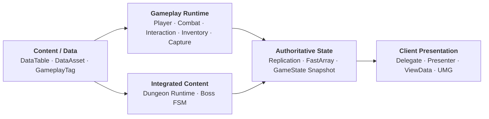

# Sonheim — Multiplayer Action Adventure


**Unreal Engine 5.5 / C++ 기반 서버 권위 멀티플레이 액션 어드벤처**입니다.  
전투·수집·장비·제작·Pal 포획/파트너 시스템을 하나의 gameplay loop로 연결하고, 이후 **Forgotten Ruins 분기형 Dungeon Vertical Slice**를 통해 Boss Encounter, 복합 HUD, Minimap, Result, Data Validation까지 확장했습니다.

[**Technical Wiki**](https://github.com/chungheonLee0325/Sonheim/wiki) ·
[**Source-only Mirror**](https://github.com/chungheonLee0325/Sonheim.Source) ·
[**AgentMcp**](https://github.com/chungheonLee0325/AgentMcp) ·
[**YouTube Demo**](https://www.youtube.com/watch?v=TDRRWp6M_9E)

---

## Project Demo

<p align="center">
  <a href="https://www.youtube.com/watch?v=TDRRWp6M_9E">
    
  </a>
</p>

<p align="center">
  <a href="https://www.youtube.com/watch?v=TDRRWp6M_9E"><b>▶ 전체 프로젝트 데모 보기</b></a>
</p>

---

## Project Overview

| 항목 | 내용 |
|---|---|
| **Engine / Language** | Unreal Engine 5.5 / C++ |
| **Networking** | Listen Server, Server RPC, Property Replication, FastArray, limited client prediction |
| **Gameplay** | Combat / Skill / Equipment / Interaction / Inventory / Crafting / Pal Capture & Partner |
| **Integrated Content** | Branching Dungeon / Boss Encounter / Reward / Record & Grade |
| **UI** | UMG, Delegate HUD, Notice Queue, Presenter → ViewData → LocalPlayer UI Router |
| **Data** | DataTable, PrimaryDataAsset / DataAsset, GameplayTag, StringTable |
| **Authoring / Verification** | Data Validation, generated Stage Graph, AgentMcp Editor automation |

초기 2인 팀 개발 이후 개인적으로 시스템을 확장하면서, 기존 gameplay 기능을 **재사용 가능한 runtime boundary**로 정리하고 Dungeon/Boss/UI/Validation까지 통합했습니다.

---

## Architecture at a Glance


```mermaid
flowchart LR
    DATA["<b>Content / Data</b><br/>DataTable · DataAsset · GameplayTag"]
    GAME["<b>Gameplay Runtime</b><br/>Player · Combat · Interaction · Inventory · Capture"]
    CONTENT["<b>Integrated Content</b><br/>Dungeon Runtime · Boss FSM"]
    STATE["<b>Authoritative State</b><br/>Replication · FastArray · GameState Snapshot"]
    VIEW["<b>Client Presentation</b><br/>Delegate · Presenter · ViewData · UMG"]

    DATA --> GAME
    DATA --> CONTENT
    GAME --> STATE
    CONTENT --> STATE
    STATE --> VIEW
```

상세한 ownership / lifecycle / synchronization 구조는 [Gameplay Architecture](https://github.com/chungheonLee0325/Sonheim/wiki/02_Gameplay_Architecture)와 [Multiplayer Synchronization](https://github.com/chungheonLee0325/Sonheim/wiki/12_Multiplayer_Synchronization)에 정리했습니다.

---

## Engineering Highlights

### Forgotten Ruins — Branching Dungeon Runtime

Dungeon을 고정된 Stage script가 아니라 **Event / Condition / Action / Transition** 조합으로 실행하는 Server Runtime으로 구성했습니다.

- GameplayTag 기반 Stage / Branch / Group / Barrier identity
- Event Queue + RunId stale-event guard + cascade budget
- Shortcut / ExtraWave branch, Objective, Barrier, Failure / Terminal state
- Reward, Best Time, Grade, SaveGame record 정산
- Runtime Snapshot → Presenter → HUD / Minimap / Result
- Definition 기반 Stage Graph 생성과 structural validation

**Shortcut branch runtime**

https://github.com/user-attachments/assets/29858da6-7d13-4297-9d71-41f53272a952

[Dungeon Runtime 상세](https://github.com/chungheonLee0325/Sonheim/wiki/09_Branching_Dungeon_Runtime)

---

### Boss Encounter — Data-driven Pattern + FSM

기존 Monster / Combat pipeline 위에 Boss 전용 FSM과 Pattern DataAsset을 추가했습니다.

- Range / Phase / Cooldown / Weight 기반 Pattern 선택
- Pattern clock 기반 Tracking → Telegraph → Strike → Recovery
- Boss/Target anchor, re-aim, Montage Section Cue
- Phase 2 / Break / Down / Exhaust / Capture Window
- 기존 `FAttackData → FCustomDamageEvent`와 Pal Capture pipeline 재사용

**Telegraph → Hit**

https://github.com/user-attachments/assets/cd81b345-d192-4374-9573-904b561f40bd

[Boss Encounter 상세](https://github.com/chungheonLee0325/Sonheim/wiki/10_Boss_Encounter_Runtime)

---

### Inventory / Equipment / Collaborative Crafting

Item state를 Player Inventory 중심으로 두고 Equipment, Container, Crafting, Dungeon Reward가 같은 경계를 사용하도록 구성했습니다.

- Inventory / Skill Spec FastArray
- Slot drag & drop limited prediction + reconciliation
- Equipment `SkillID` → `ReplaceGrant()`로 현재 공격 Skill 교체
- shared Container viewer lifecycle
- Recipe Definition / `FActiveCraftWork` 분리
- Recipe 시작 ownership과 이후 collaborative work 분리
- completed result / unfinished unit lifecycle 분리

**Collaborative Crafting**

https://github.com/user-attachments/assets/df9a30d1-8d52-4b86-9f18-790474fdbda2

[Inventory & Crafting 상세](https://github.com/chungheonLee0325/Sonheim/wiki/07_Inventory_Crafting)

---

### Combat / Skill / Animation Timing

Skill의 정적 정의, replicated state, runtime logic을 분리하고 Animation Timeline을 실제 gameplay timing의 authoring point로 사용했습니다.

- `FSkillData / FSonheimSkillSpecItem / UBaseSkill` 역할 분리
- Grant Source + RefCount로 Skill ownership 관리
- Cost phase / Cast lifecycle
- AnimNotify 기반 Skill Fire / Melee Window / Action / Cancel timing
- Line / Sphere / Capsule / Box hit shape
- fast melee frame interpolation + duplicate hit suppression
- Damage context를 `FCustomDamageEvent`로 Target까지 전달

**Equipment → Skill switch**

https://github.com/user-attachments/assets/2079af91-4ad9-4f93-99e1-3e21efbca57f

[Combat / Skill / Animation 상세](https://github.com/chungheonLee0325/Sonheim/wiki/05_Combat_Skill_Animation)

---

### Pal Capture → Ownership → Partner AI

Wild Monster를 별도 Partner class로 교체하는 대신 같은 Actor의 ownership / active state를 전환해 Capture부터 Summon까지 lifecycle을 연결했습니다.

- eligibility / probability / reveal / ownership mutation 분리
- Server에서 Capture 결과와 reveal parameter 결정
- Pal Inventory / Selected Slot
- same Monster Actor deactivate / activate
- Ownership 기반 Partner AI / IFF
- Boss Exhaust 상태에서도 같은 Capture pipeline 재사용

https://github.com/user-attachments/assets/57246d79-bd3b-473f-85fc-762670023729

[Pal Capture & Partner Lifecycle 상세](https://github.com/chungheonLee0325/Sonheim/wiki/08_Pal_Capture_Partner_Lifecycle)

---

### UI Architecture / Content Presentation

단순 HUD는 gameplay owner의 Delegate를 구독하고, 여러 state가 동시에 필요한 Dungeon UI는 별도 presentation layer를 사용합니다.

- Persistent HUD / Inventory / Container / Crafting screen
- `UNoticeSubsystem`의 Slot / Queue / Channel / Style
- Dungeon Snapshot → Presenter → ViewData → UI Router
- Minimap / Marker / Party / Boss / Result
- Widget 재생성 시 현재 Snapshot에서 state reconstruction
- server-time 기반 countdown / elapsed time

[UI Architecture & Client Presentation](https://github.com/chungheonLee0325/Sonheim/wiki/11_Client_State_Presentation_Pipeline)

---

### Content Authoring / Validation

DataAsset을 단순 설정 저장소로 두지 않고, 콘텐츠 구조 자체를 검증하는 authoring workflow를 추가했습니다.

- Editor metadata constraint / GameplayTag namespace
- Stage identity / transition order
- cycle / reachability
- producer-before-consumer
- TimeLimit / Timeout / Grade fallback
- Boss Telegraph timing / Area geometry / Montage section contract
- Definition → Mermaid Stage Graph generation

[Content Authoring & Validation](https://github.com/chungheonLee0325/Sonheim/wiki/13_Content_Authoring_Validation)

---

## Technical Wiki

README는 프로젝트의 **결과와 대표 구현**만 요약합니다. 세부 설계와 실제 code/data flow는 Wiki에서 확인할 수 있습니다.

| 문서 | 주요 내용 |
|---|---|
| [Project Overview](https://github.com/chungheonLee0325/Sonheim/wiki/01_Project_Overview) | Gameplay loop와 전체 구현 범위 |
| [Gameplay Architecture](https://github.com/chungheonLee0325/Sonheim/wiki/02_Gameplay_Architecture) | Lifetime / ownership / component / presentation boundary |
| [Data & Content Architecture](https://github.com/chungheonLee0325/Sonheim/wiki/03_Data_Content_Architecture) | DataTable / DataAsset / GameplayTag / Soft Reference |
| [Combat, Skill & Animation](https://github.com/chungheonLee0325/Sonheim/wiki/05_Combat_Skill_Animation) | Skill lifecycle, AnimNotify timing, Hit / Damage |
| [Inventory & Crafting](https://github.com/chungheonLee0325/Sonheim/wiki/07_Inventory_Crafting) | FastArray, Equipment, Container, collaborative crafting |
| [Branching Dungeon Runtime](https://github.com/chungheonLee0325/Sonheim/wiki/09_Branching_Dungeon_Runtime) | Event-driven Stage runtime / branch / objective / result |
| [Boss Encounter Runtime](https://github.com/chungheonLee0325/Sonheim/wiki/10_Boss_Encounter_Runtime) | FSM / Pattern / Telegraph / Phase / Capture |
| [UI Architecture](https://github.com/chungheonLee0325/Sonheim/wiki/11_Client_State_Presentation_Pipeline) | HUD / Notice / Presenter / UI Router |
| [Multiplayer Synchronization](https://github.com/chungheonLee0325/Sonheim/wiki/12_Multiplayer_Synchronization) | RPC / replication / scope / prediction / relevancy |
| [Content Authoring & Validation](https://github.com/chungheonLee0325/Sonheim/wiki/13_Content_Authoring_Validation) | Structural / graph / Boss validation |
| [Unreal Editor Automation](https://github.com/chungheonLee0325/Sonheim/wiki/14_Unreal_Editor_Automation_Verification) | AgentMcp 기반 Editor authoring / verification |

---

## Repository Layout

```text
Sonheim/Source/Sonheim/
├─ Animation/        # AnimInstance / AnimNotify
├─ AreaObject/       # Player / Monster / Skill / Attribute / AI
├─ GameManager/      # GameInstance / GameMode / GameState / Dungeon runtime
├─ GameObject/       # Item / Resource / Container / Crafting / Dungeon world actors
├─ ResourceManager/  # Gameplay data types / DataTable row structs
├─ UI/               # HUD / Inventory / Notice / Dungeon presentation
└─ Utilities/        # Shared gameplay / editor-side helpers
```

코드 중심 검토가 필요한 경우 [Sonheim.Source](https://github.com/chungheonLee0325/Sonheim.Source)를 사용할 수 있습니다.

---

## Build

- **Engine**: Unreal Engine 5.5
- **IDE**: Visual Studio 2022 / Rider
- `Sonheim.uproject`에서 Visual Studio project files 생성
- `Development Editor` configuration으로 build 후 Editor 실행
- Multiplayer test는 Listen Server + Client PIE 또는 Steam/Null OSS 환경에서 진행

---

## Related Repository

- [**Sonheim.Source**](https://github.com/chungheonLee0325/Sonheim.Source) — Source / Config / Docs 중심 코드 검토용 mirror
- [**AgentMcp**](https://github.com/chungheonLee0325/AgentMcp) — UE 5.5 Editor MCP / agent workflow plugin
