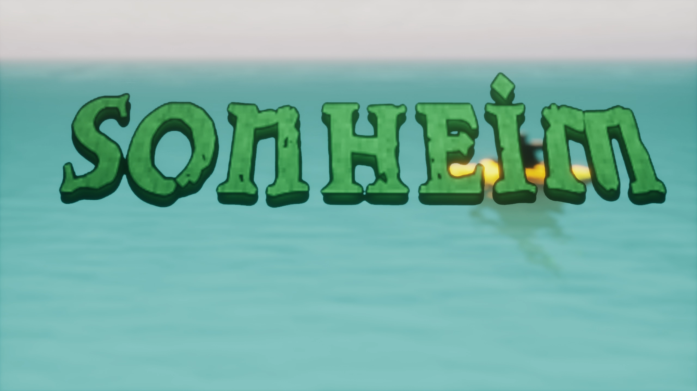
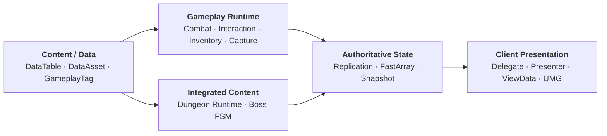

# Sonheim — Multiplayer Action Adventure



**Unreal Engine 5.5 / C++ 기반 서버 권위 멀티플레이 액션 어드벤처**입니다.  
전투·수집·장비·제작·Pal 포획/파트너 시스템을 구현하고, 이후 **Forgotten Ruins 분기형 Dungeon Vertical Slice**를 통해 Boss Encounter, Minimap, Result, Validation까지 확장했습니다.

[**Technical Wiki**](https://github.com/chungheonLee0325/Sonheim/wiki) ·
[**Source-only Mirror**](https://github.com/chungheonLee0325/Sonheim.Source) ·
[**AgentMcp**](https://github.com/chungheonLee0325/AgentMcp) ·
[**YouTube Demo**](https://www.youtube.com/watch?v=TDRRWp6M_9E)

---

## Project Demo

<p align="center">
  <a href="https://www.youtube.com/watch?v=TDRRWp6M_9E">
    
  </a>
</p>

<p align="center">
  <a href="https://www.youtube.com/watch?v=TDRRWp6M_9E"><b>▶ 전체 프로젝트 데모 보기</b></a>
</p>

---

## Project Overview

| 항목 | 내용 |
|---|---|
| **Engine / Language** | Unreal Engine 5.5 / C++ |
| **Networking** | Listen Server, Server RPC, Property Replication, FastArray, limited client prediction |
| **Gameplay** | Combat / Skill / Equipment / Interaction / Inventory / Crafting / Pal Capture & Partner |
| **Integrated Content** | Branching Dungeon / Boss Encounter / Reward / Record & Grade |
| **UI** | UMG, Delegate HUD, Notice Queue, Presenter → ViewData → UI Router |
| **Data / Authoring** | DataTable, DataAsset, GameplayTag, StringTable, Data Validation |

초기 2인 팀 개발 이후 개인적으로 시스템을 확장하면서 기존 gameplay 기능을 재사용 가능한 runtime boundary로 정리하고, Dungeon/Boss/UI/Validation까지 통합했습니다.

---

## Architecture at a Glance


```mermaid
flowchart LR
    DATA["<b>Content / Data</b><br/>DataTable · DataAsset · GameplayTag"]
    GAME["<b>Gameplay Runtime</b><br/>Combat · Interaction · Inventory · Capture"]
    CONTENT["<b>Integrated Content</b><br/>Dungeon Runtime · Boss FSM"]
    STATE["<b>Authoritative State</b><br/>Replication · FastArray · Snapshot"]
    VIEW["<b>Client Presentation</b><br/>Delegate · Presenter · ViewData · UMG"]

    DATA --> GAME
    DATA --> CONTENT
    GAME --> STATE
    CONTENT --> STATE
    STATE --> VIEW
```

[Gameplay Architecture 자세히 보기 →](https://github.com/chungheonLee0325/Sonheim/wiki/02_Gameplay_Architecture)

---

## Selected Work

### Forgotten Ruins — Branching Dungeon

Stage Graph 기반의 분기형 멀티플레이 Dungeon입니다.  
Shortcut / ExtraWave 선택에 따라 Stage, Objective, Barrier, Reward가 달라지고 Boss Encounter와 Result까지 하나의 Run으로 이어집니다.

https://github.com/user-attachments/assets/29858da6-7d13-4297-9d71-41f53272a952

[Branching Dungeon Runtime 자세히 보기 →](https://github.com/chungheonLee0325/Sonheim/wiki/09_Branching_Dungeon_Runtime)

---

### Boss Encounter

기존 Monster / Combat 시스템 위에 Boss 전용 FSM과 Pattern Data를 추가해 Telegraph, Tracking, Phase, Down, Exhaust, Capture Window를 구성했습니다.

https://github.com/user-attachments/assets/cd81b345-d192-4374-9573-904b561f40bd

[Boss Encounter Runtime 자세히 보기 →](https://github.com/chungheonLee0325/Sonheim/wiki/10_Boss_Encounter_Runtime)

---

### Inventory & Collaborative Crafting

Player Inventory를 중심으로 Equipment, Shared Container, Crafting이 같은 Item state를 사용합니다.  
여러 Player가 하나의 ActiveWork에 참여하고 완료 결과를 Inventory로 수령하는 제작 흐름을 구현했습니다.

https://github.com/user-attachments/assets/df9a30d1-8d52-4b86-9f18-790474fdbda2

[Inventory & Crafting 자세히 보기 →](https://github.com/chungheonLee0325/Sonheim/wiki/07_Inventory_Crafting)

---

### Pal Capture & Partner

Wild Monster의 Capture 결과를 Ownership / Storage / Selection / Summon으로 연결하고, 같은 Monster Actor가 소유 상태에 따라 Partner AI로 동작하도록 구성했습니다.

https://github.com/user-attachments/assets/57246d79-bd3b-473f-85fc-762670023729

[Pal Capture & Partner Lifecycle 자세히 보기 →](https://github.com/chungheonLee0325/Sonheim/wiki/08_Pal_Capture_Partner_Lifecycle)

---

## Engineering Index

| Area | Highlight | Detail |
|---|---|---|
| **Player / Character** | PlayerState / Pawn lifecycle, Stat source, Equipment → Skill | [Wiki 04](https://github.com/chungheonLee0325/Sonheim/wiki/04_Player_Character_Systems) |
| **Combat / Skill** | Skill Data/State/Logic, AnimNotify timing, melee interpolation, Damage Context | [Wiki 05](https://github.com/chungheonLee0325/Sonheim/wiki/05_Combat_Skill_Animation) |
| **Interaction** | Interface 기반 Detection / Prompt / Hold / Server execution | [Wiki 06](https://github.com/chungheonLee0325/Sonheim/wiki/06_World_Interaction_Systems) |
| **Inventory / Crafting** | FastArray, limited prediction, Equipment, Container, shared Crafting | [Wiki 07](https://github.com/chungheonLee0325/Sonheim/wiki/07_Inventory_Crafting) |
| **Multiplayer** | Request / State / Scope / Prediction / Relevancy | [Wiki 12](https://github.com/chungheonLee0325/Sonheim/wiki/12_Multiplayer_Synchronization) |
| **UI** | Delegate HUD, Notice Queue, Snapshot → Presenter → ViewData → Router | [Wiki 11](https://github.com/chungheonLee0325/Sonheim/wiki/11_Client_State_Presentation_Pipeline) |
| **Validation** | Transition order, cycle/reachability, producer precedence, Boss contract | [Wiki 13](https://github.com/chungheonLee0325/Sonheim/wiki/13_Content_Authoring_Validation) |
| **Editor Tooling** | AgentMcp 기반 Blueprint/UMG/Data/Animation authoring + PIE verification | [Wiki 14](https://github.com/chungheonLee0325/Sonheim/wiki/14_Unreal_Editor_Automation_Verification) |

---

## Technical Wiki

README는 **결과와 대표 구현**만 보여주고, 세부 설계·trade-off·code/data flow는 Wiki에서 다룹니다.

- [Project Overview](https://github.com/chungheonLee0325/Sonheim/wiki/01_Project_Overview)
- [Gameplay Architecture](https://github.com/chungheonLee0325/Sonheim/wiki/02_Gameplay_Architecture)
- [Data & Content Architecture](https://github.com/chungheonLee0325/Sonheim/wiki/03_Data_Content_Architecture)
- [Branching Dungeon Runtime](https://github.com/chungheonLee0325/Sonheim/wiki/09_Branching_Dungeon_Runtime)
- [Boss Encounter Runtime](https://github.com/chungheonLee0325/Sonheim/wiki/10_Boss_Encounter_Runtime)
- [Development History & Retrospective](https://github.com/chungheonLee0325/Sonheim/wiki/15_Development_History_Retrospective)

---

## Repository Layout

```text
Sonheim/Source/Sonheim/
├─ Animation/        # AnimInstance / AnimNotify
├─ AreaObject/       # Player / Monster / Skill / Attribute / AI
├─ GameManager/      # GameInstance / GameMode / GameState / Dungeon runtime
├─ GameObject/       # Item / Resource / Container / Crafting / Dungeon actors
├─ ResourceManager/  # Gameplay data types / DataTable row structs
├─ UI/               # HUD / Inventory / Notice / Dungeon presentation
└─ Utilities/        # Shared helpers
```

코드 중심 검토는 [Sonheim.Source](https://github.com/chungheonLee0325/Sonheim.Source)에서 확인할 수 있습니다.

---

## Build

- **Engine**: Unreal Engine 5.5
- **IDE**: Visual Studio 2022 / Rider
- `Sonheim.uproject`에서 Visual Studio project files 생성
- `Development Editor` configuration으로 build 후 Editor 실행
- Multiplayer test는 Listen Server + Client PIE 또는 Steam/Null OSS 환경에서 진행

---

## Related Repositories

- [**Sonheim.Source**](https://github.com/chungheonLee0325/Sonheim.Source) — Source / Config / Docs 중심 코드 검토용 mirror
- [**AgentMcp**](https://github.com/chungheonLee0325/AgentMcp) — UE 5.5 Editor MCP / agent workflow plugin
